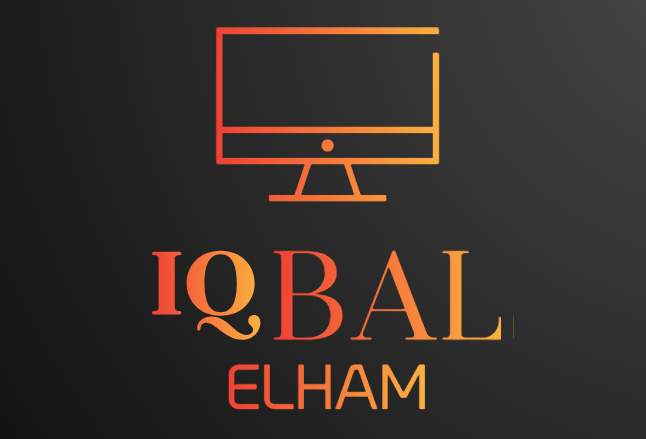

<a name="readme-top"></a>


<div align="center">

  
  <br/>

  <h3><b>Full Stack Developer</b></h3>

</div>

<!-- TABLE OF CONTENTS -->
# 📗 Table of Contents

- [📖 About the Project](#about-project)
  - [🛠 Built With](#built-with)
    - [Tech Stack](#tech-stack)
    - [Key Features](#key-features)
- [💻 Getting Started](#getting-started)
  - [Setup](#setup)
  - [Prerequisites](#prerequisites)
  - [Install](#install)
  - [Usage](#usage)
- [👥 Authors](#authors)
- [🔭 Future Features](#future-features)
- [🤝 Contributing](#contributing)
- [⭐️ Show your support](#support)
- [🙏 Acknowledgements](#acknowledgements)
- [📝 License](#license)

<!-- PROJECT DESCRIPTION -->

# 📖 Budget App <a name="about-project"></a>

> Smart Money is a mobile web application where you can manage your Money: you have a list of expenses associated with a category, so that you can see how much money you spent and on which category.

<div align="center"></div>


## 🛠 Live Demo <a name="built-with"></a>

[Smart Money](https://smart-budget-h6ag.onrender.com/)
## 🛠 Video Presentation  <a name="built-with"></a>

[Loom video link](https://www.loom.com/share/751ba822cbe84f60bc7733a5366cc9ea?sid=c30ac96d-8059-4746-bcd4-c1d2fed41286)

## 🛠 Built With <a name="built-with"></a>

### Tech Stack <a name="tech-stack"></a>

> This project uses the following stack :

<details>
  <summary>Ruby</summary>
  <summary>Ruby on Rails</summary>
  <summary>HTML</summary>
  <summary>CSS</summary>
  <summary>Bootstrap</summary>
  <summary>JavaScript</summary>
</details>

<!-- Features -->

### Key Features <a name="key-features"></a>

<!-- > Describe between 1-3 key features of the application. -->

- **Budget App**
- **Class and Objects**
- **Object Oriented Programming**
- **Four Principle of OOP**

<p align="right">(<a href="#readme-top">back to top</a>)</p>


<!-- GETTING STARTED -->

## 💻 Getting Started <a name="getting-started"></a>

<!-- > Clone the repository by clicking on the 'Code' button and copy the link -->

To get a local copy up and running, follow these steps.

### Prerequisites

In order to run this project you need:

You should have Ruby install on your local machine

### Setup

Clone this repository to your desired folder:

Example commands:

```sh
  cd my-folder
  git clone https://github.com/iqbal-elham/budget-app.git
```

### Install

To install ruby go to : [Install Ruby](https://rubyinstaller.org/) and select your operating system.


### Usage

To run the project, open your project in your terminal  and type ruby test.rb .

Example command:

```sh
  ruby test.rb
```

<p align="right">(<a href="#readme-top">back to top</a>)</p>

<!-- AUTHORS -->

## 👥 Author <a name="authors"></a>

👤 **Iqbal Elham**

- <a href='https://www.linkedin.com/in/iqbal-elham/' target="_blank"></a>
- <a href='mailto:iqbal.elham7@gmail.com' target="_blank"></a>


<p align="right">(<a href="#readme-top">back to top</a>)</p>

<!-- FUTURE FEATURES -->

## 🔭 Future Features <a name="future-features"></a>

<!-- > Describe 1 - 3 features you will add to the project. -->

- **Write tests**
- **Add icon photos uploader**

<p align="right">(<a href="#readme-top">back to top</a>)</p>

<!-- CONTRIBUTING -->

## 🤝 Contributing <a name="contributing"></a>

Contributions, issues, and feature requests are welcome!

Feel free to check the [issues page](https://github.com/iqbal-elham/budget-app/issues).

<p align="right">(<a href="#readme-top">back to top</a>)</p>

<!-- SUPPORT -->

## ⭐️ Show your support <a name="support"></a>

Give a ⭐️ if you like this project!

<p align="right">(<a href="#readme-top">back to top</a>)</p>

<!-- ACKNOWLEDGEMENTS -->

## 🙏 Acknowledgments <a name="acknowledgements"></a>

> I would like to thank Microverse for helping us in the journey to become a Fullstack developer.

> Special thanks to [Gregoire Vella](https://www.behance.net/gregoirevella) for making an awesome design idea.

<p align="right">(<a href="#readme-top">back to top</a>)</p>

<!-- LICENSE -->

## 📝 License <a name="license"></a>

This project is [MIT](./MIT.md) licensed.

<p align="right">(<a href="#readme-top">back to top</a>)</p>
